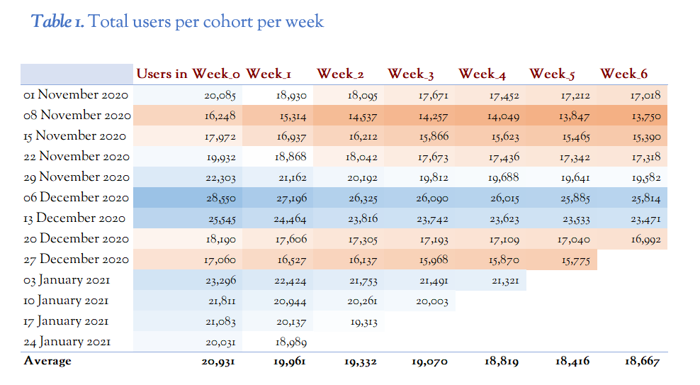

# Cohort analysis of customer retention using SQL and Excel

## 📌 Overview  

If you are a business whose customers subscribe to a product or service, it is very important to understand their behaviour. A cohort analysis can be applied to better understand **when and why customers are likely to unsubscribe (churn),** and develop strategies to prevent this from occurring.

---

### 📊 Example Use Case: Sustainability Reporting Company  

A company providing **sustainability compliance and CSRD (EU's Corporate Sustainability Reporting Directive) reporting services** wants to improve customer retention.

Using a cohort analysis, the company notices that **20% of customers are disengaging with the software after the first three weeks**.  

**🔍 Why might this be?**  
- The onboarding process is **too complicated**  
- It's unclear how the service helps them to **achieve CSRD compliance**  
- The company hasn’t provided enough **guidance** to help customers interpret their sustainability data  

Compare this with a scenario where **retention rates are high for the first eight weeks, but drop off from week nine onwards**.  

**📉 What does this suggest?**  
- It is **unrelated to onboarding**  
- Customers see the product as a **short-term solution**  
- They need help **conducting a gap analysis**, but after completing the initial compliance assessment, they **no longer feel the need to use the company's services**  
- The company's **data collection and advisory services do not provide enough additional value** to justify the subscription  

By just looking at a summary of **monthly subscription numbers** or **quarterly figures**, these trends would remain hidden.  

A **cohort analysis** provides **data-driven insights**, which lead to **better decisions and increased profitability**.

This can be combined with a **funnel analysis** `[insert link]` to explicitly determine **where in the process your customers are losing value from your offering**.  

- A **cohort analysis** offers a **week-by-week summary**  
- A **funnel analysis** can track customers from onboarding **to materiality assessment, gap analysis, and onwards**  

This can help you to **identify exactly where you are losing customers**, but also **where there might be bottlenecks that require extra resources**.

---

## 📂 Project Description  

This project uses a **cohort analysis** to examine **retention rates** of subscribed users over a **six-week period**.  

- **📊 SQL queries** generate **weekly retention cohorts** based on raw user subscription data  
- **📈 Excel dashboards** transform SQL’s tabular data into **interactive visuals** for better insights  
- **📉 Retention metrics** highlight **when users unsubscribe**  

The analysis is based on **SQL queries** that calculate **weekly retention and churn rates**, allowing for an **in-depth investigation into customer engagement** with the subscription service.

---

## 📁 Project Structure  

### 1️⃣ **Input File**  
- The `'subscriptions.csv'` file represents the **raw data**, which can be analysed in SQL

### 2️⃣ **SQL Code**  
- The SQL code generates **weekly cohorts** and calculates retention by **counting active users per week over a six-week period**  
- Each **weekly cohort** includes:  
  - **🟢 Number of subscribers (Week 0):** Initial count of users who started a subscription in that week  
  - **📊 Retention counts for weeks 1 to 6:** Counts of subscribers who remain active in each subsequent week  
- From this code, **📉 churn and retention rates** are calculated to assess **subscriber behaviour trends**

### 3️⃣ **Excel Dashboard**  
- The **📈 Excel dashboard** provides visualizations that offer insights into **user retention patterns over time**  
- Visualizations include:  
  - **📊 Total users per cohort per week:** Displays the number of active users in each week following their subscription start  
  - **📉 Retention rate relative to users in Week 0:** Shows the percentage of users remaining active each week relative to the initial cohort size  
  - **📉 Retention rate relative to users in the previous week:** Highlights week-over-week retention, identifying which weeks have the highest or lowest retention rates  

---

## 🛠 How to Use the SQL Script  

### 1️⃣ **Define the Date Range**  
- Modify the **`date_range` CTE** if you wish to analyze a different period  

### 2️⃣ **Run the Main Query**  
- Use the **`main` CTE** to filter subscriptions data within the defined date range  

### 3️⃣ **Calculate Active Customers by Week**  
- The **`output` CTE** calculates the active subscribers per cohort for **weeks 1 to 6**  

### 4️⃣ **Calculate Churn and Retention Rates**  
- Additional **CTEs** provide:  
  - **📉 Churn rate:** `churn_rate`  
  - **📊 Retention rate metrics:** `retention_rate_vs_week_0` and `retention_rate_vs_previous_week`  

---

## 📊 Visuals and Findings  

### **Total Users per Cohort per Week**  
  

### **Retention Rate Relative to Users in Week 0**  
  

### **Retention Rate Relative to Users in the Previous Week**  
  

---

## ✅ Findings  

1. The **largest subscriber cohorts** were in early **December**, with **above-average retention observed** in early to mid-January. Smaller cohorts appeared in **mid-November and late December**, likely due to the **holiday season**.  

2. **November cohorts showed lower retention in week 1 and week 6** compared to later cohorts, with **retention rates improving significantly by mid-December**. In **January**, week 1 retention started to decline slightly, with a drop from **96% in mid-December to 93% by mid-January**.  

3. **Across all cohorts, week 1 exhibited the highest churn rate**, while **week 6 retained at least 99% of users from the previous week**. **Retention was strongest in December cohorts,** followed by **January and November**. **Improving retention in weeks 1 and 2** would have the **most impact on overall retention rates**.  

---

## 🎯 Recommendations  

1. **Investigate** why more users were subscribing in **early December 2020** relative to **January 2021**.  
2. **Determine** why retention rates between **week 0 and week 1** were higher in **late December cohorts** than in **January cohorts**.  
3. **Focus on strategies** to **improve retention rates between weeks 0 and 1**, to have the **largest impact on overall retention rates**.  

---

## 🤝 Contribution Guidelines  

Contributions are welcome! Please feel free to submit a **pull request** or raise an **issue** if you have any suggestions.
