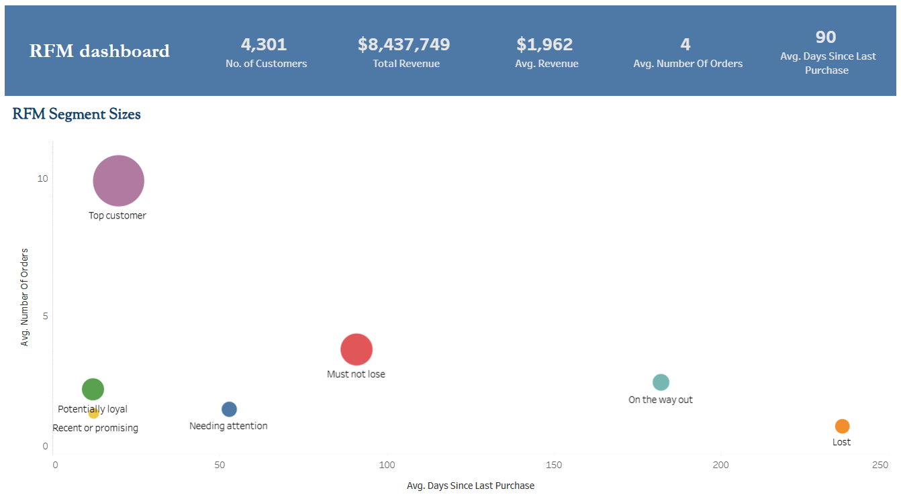
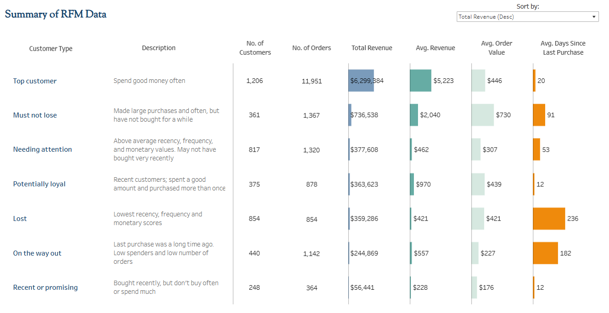

# RFM Segmentation Project (Recency, Frequency, Monetary)

This project implements RFM segmentation using SQL to categorise customers based on their purchasing behaviour.

## Project Overview

RFM (Recency, Frequency, Monetary) segmentation is a technique used in marketing and customer analytics to analyse and segment customers based on:

- **Recency**: How recently a customer made a purchase  
- **Frequency**: How often a customer makes a purchase  
- **Monetary**: The total amount a customer has spent  

The project involves extracting and processing customer transaction data using SQL, then visualising the results using Tableau.

## Files in This Repository

| File Name                               | Description |
|----------------------------------------|-------------|
| `original_dataset_sample_1000.csv`    | Sample customer transaction dataset |
| `RFM matrix reference sheet.xlsx`     | Reference sheet for RFM segmentation logic |
| `RFM_code.sql`                         | SQL script for calculating RFM scores and segmenting customers |
| `RFM_output.csv`                       | Processed output with RFM scores and customer segments |
| `rfm_dashboard_1.png`                  | RFM dashboard visualisation (summary view) |
| `rfm_dashboard_2.png`                  | Detailed summary of RFM segmentation |

## SQL Logic Used

The SQL script performs the following steps:

1. Extracts relevant customer transaction data.
2. Calculates **Recency**, **Frequency**, and **Monetary** values.
3. Assigns RFM scores to each customer.
4. Segments customers based on their RFM scores.

## Dashboard Insights

- The **Top customers** spend frequently and generate the highest revenue (more than twice the average revenue of any other segment). They are loyal and are likely to continue purchasing in the future.
- The **Must not lose** category includes high-value customers who haven't purchased recently. When they do spend, they spend the most: average order value of $730, considerably higher than top customers, who have an average order value of $446). If they could be persuaded to come back, they are likely to spend much more per order than any other segment.  
- The **Potentially loyal** customers have the third highest average revenue ($970, compared with $5,223 for top customers and $2,040 for must not lose customers), and an average order value of $439 (similar to top customers). They show promise for the future.

### RFM Dashboard Visualisations

#### Bubble chart (monetary metrics represented by bubble size)

#### Summary of RFM Segments
  

## Technologies Used

- **SQL** (for data extraction and processing)  
- **Excel** (for reference sheet)  
- **Tableau** (for visualisation)  

## Tableau Public Link

The RFM analysis and visualisation were done in Tableau. You can view the interactive dashboard here:  
👉 [View RFM Dashboard on Tableau Public](https://public.tableau.com/app/profile/james.davies4008/viz/MAT-P3-RFMJamesDavies/Dashboard)
