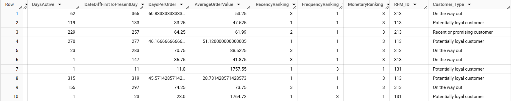

# RFM Segmentation Project (Recency, Frequency, Monetary)

This project implements RFM segmentation using SQL to categorise customers based on their purchasing behaviour.

## Project Overview

RFM (Recency, Frequency, Monetary) segmentation is a technique used in marketing and customer analytics to analyse and segment customers based on:

- **Recency**: How recently a customer made a purchase  
- **Frequency**: How often a customer makes a purchase  
- **Monetary**: The total amount a customer has spent  

The project involves extracting and processing customer transaction data using SQL, then visualising the results using Tableau.

You can view the interactive dashboard here:  
👉 [View RFM Dashboard on Tableau Public](https://public.tableau.com/app/profile/james.davies4008/viz/CustomersegmentationanalysisusingRFM/Dashboard)

  

---

## 📁 Project Structure

### 1️⃣ Input File
The dataset used for this analysis consists of raw transaction data stored in a CSV file.  
- The file contains **customer transactions** with details such as purchase dates, amounts, and customer IDs.
- This data is processed using SQL to generate **RFM scores**.

#### 🖼 Sample Input Data:
  

---

### 2️⃣ SQL Code
The SQL script processes the raw data to compute **Recency, Frequency, and Monetary (RFM) scores** for each customer.  
It performs the following operations:

- **Recency**: Calculates how many days have passed since the last purchase.
- **Frequency**: Counts the number of transactions per customer.
- **Monetary**: Sums up the total spend per customer.
- **Segmentation**: Assigns customers to RFM groups based on their scores.

#### 🖼 SQL Output:

---

### 3️⃣ Tableau Dashboard
The processed RFM data is visualised using **Tableau**, providing key insights into customer segments.

**Key visualisations include:**
- **Bubble Chart**: Displays different customer groups based on their RFM scores.
- **Segment Summary**: Shows key statistics like revenue, order values, and average days since the last purchase.

---

## SQL Logic Used

The SQL script performs the following steps:

1. Extracts relevant customer transaction data.
2. Calculates **Recency**, **Frequency**, and **Monetary** values.
3. Assigns RFM scores to each customer.
4. Segments customers based on their RFM scores.

## Dashboard Insights

- The **Top customers** spend frequently and generate the highest revenue (more than twice the average revenue of any other segment). They are loyal and are likely to continue purchasing in the future.
- The **Must not lose** category includes high-value customers who haven't purchased recently. When they do spend, they spend the most: average order value of $730, considerably higher than top customers, who have an average order value of $446. If they could be persuaded to come back, they are likely to spend much more per order than any other segment.  
- The **Potentially loyal** customers have the third highest average revenue ($970, compared with $5,223 for top customers and $2,040 for must not lose customers), and an average order value of $439 (similar to top customers). They show promise for the future.

---

## Software Used

- **SQL (BigQuery)** (for data extraction and processing)  
- **Excel** (for reference sheet)  
- **Tableau** (for visualisation)  
