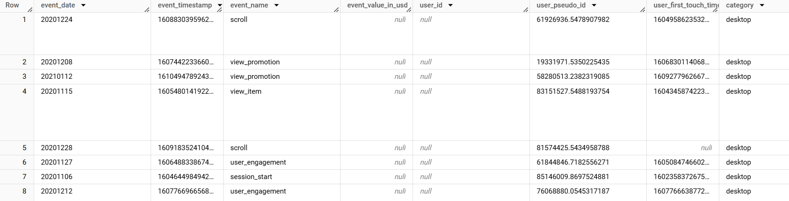
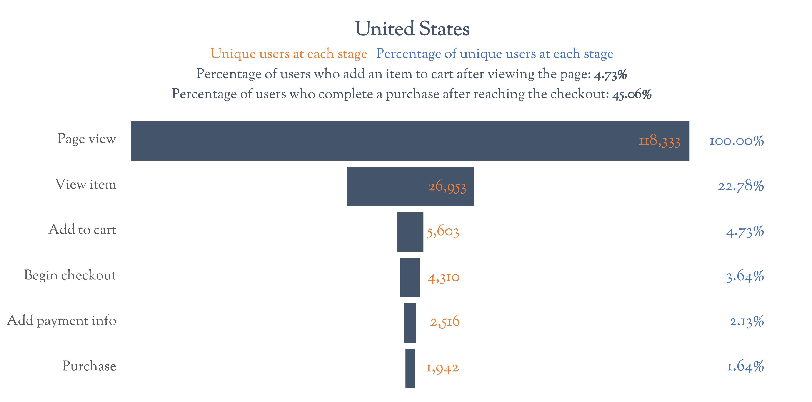
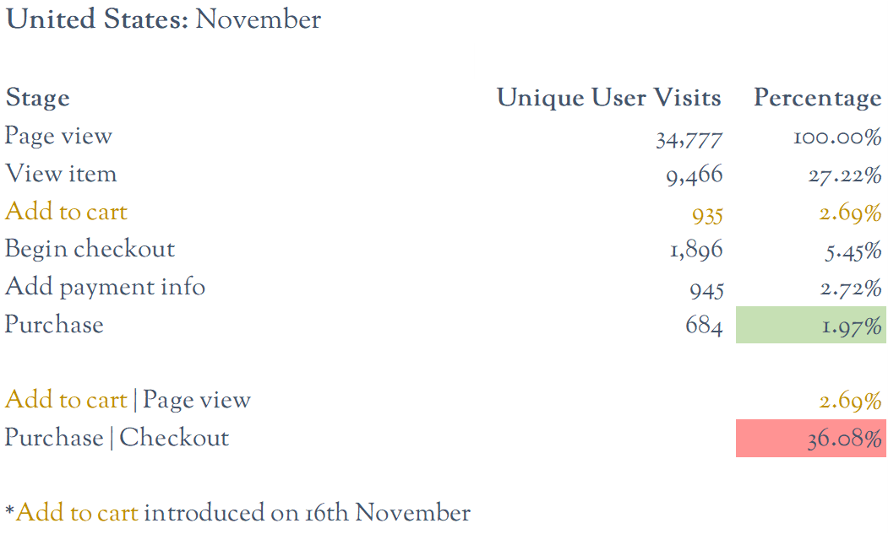
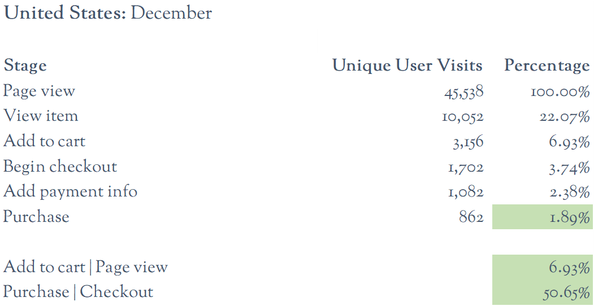
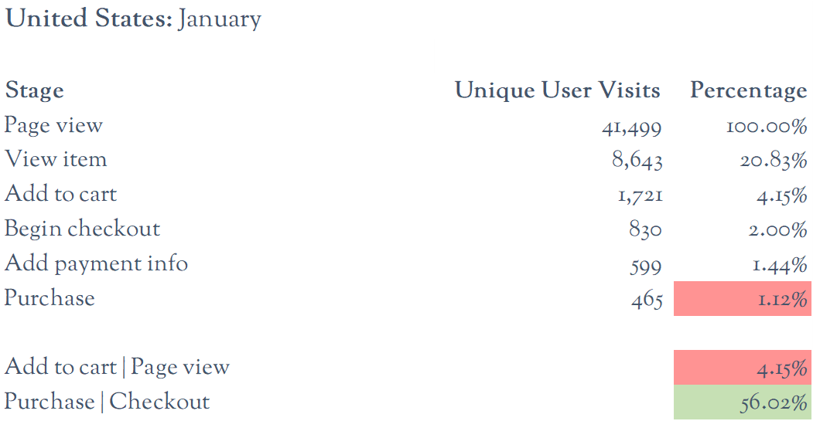
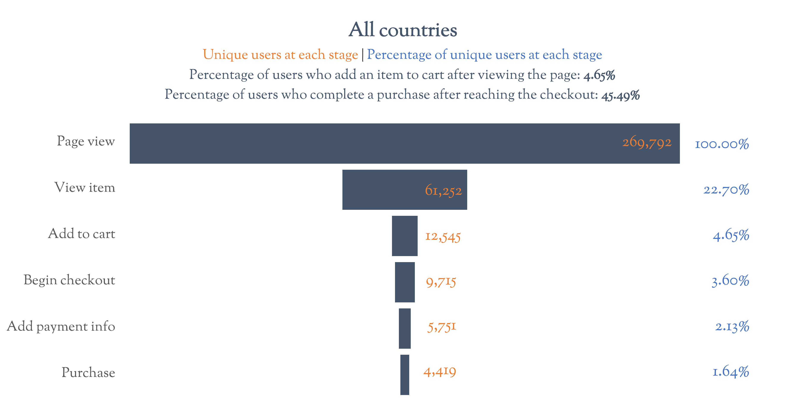

# 📊 Customer conversion analysis using funnels

## 📌 Introduction
This funnel analysis tracks the **customer journey** from initial website interaction to completed purchase using data from the `raw_events` table.

Key stages analysed:
- **Page views**: Users visiting the company’s webpage.
- **View item**: Users viewing a product in detail.
- **Add to cart**: Users adding items to their shopping cart.
- **Begin checkout**: Users starting the checkout process.
- **Add payment info**: Users entering payment details.
- **Purchase**: Users completing a purchase.

To ensure accurate conversion metrics, **duplicate events are removed** by keeping only the first occurrence per unique user. This prevents inflation of conversion rates and provides a **realistic view of user behaviour**.

---

## 📁 Project Structure

### 1️⃣ Input File
The dataset used for this analysis is stored in a CSV file (`raw_events_sample.csv`).  
- It contains raw **user interaction data** from the website.
- Each row represents an **event**, with details like user ID, timestamp, and event type (e.g., `page_view`, `add_to_cart`, `purchase`).
- This data is processed using SQL to build the **conversion funnel**.

#### 🖼 Sample Input Data:
  

---

### 2️⃣ SQL Code
The SQL queries transform the raw event data into a structured **conversion funnel analysis**.

- **`Funnel_Analysis_1_All.sql`**: Extracts **unique users** for the entire time period, avoiding duplicate user counts.
- **`Funnel_Analysis_2_By_Month.sql`**: Tracks **unique users per month**, ensuring users are counted in each month they make a purchase.

🔍 These queries analyse conversion trends over time, helping to understand variations across months and user behaviour.

#### 🖼 SQL Query Outputs:
  
  

---

### 3️⃣ Funnel Dashboard
The processed data is visualised using **Excel**, providing key insights into **drop-off rates and conversion rates** at each stage of the funnel.---

---

## 📊 Dashboard and data

### 📌 Excel analysis
- **Dashboard:** Provides an **overview of conversion rates** across different countries and months.

An example of conversion rates in the United States from November to January can be found below:

⚠ **Dataset size note**:  
The **original dataset** contains **over 5 million rows** and cannot be downloaded.  
However, a **sample of 1,000 rows** (`raw_events_sample`) is available for reference.

---

## 📈 Summary of findings

- **Overall conversion rate:**  
  On average, only **1.64%** of users who visit the webpage make a purchase.

- **Drop-off rates at each funnel stage:**  
  - **22.70%** of users who view the page go on to view an item.
  - **4.65%** of users add an item to the cart.
  - **3.60%** of users begin the checkout process.
  - **2.13%** of users enter their payment info.
  - **1.64%** of users complete a purchase.

- **Checkout-to-purchase conversion rate:**  
  - **45.49%** of users who reach the **checkout** stage complete their purchase.
  - This varied significantly across months:
    - **Lowest in November: 36%**
    - **Highest in January: 55%**

- **Monthly performance:**  
  - **December saw the most purchases** (**1,975 unique users**), with the **United States** responsible for over **40%** (**862 purchases**).
  - **January purchases dropped by nearly 50%** compared to December, with only **1,069 users making a purchase**.

---

## 🔎 Possible interpretation

- **Seasonal effect:**  
  The **higher purchase rates in December** suggest that **Christmas shopping influenced user behaviour**. The sharp **drop in January purchases** might be due to users having already bought gifts in previous months.

- **November checkout drop-off:**  
  The **lower purchase rate in November (36%)** could be due to:
  - **A less user-friendly website** (possibly missing an "add to cart" button until mid-November).
  - **Users browsing but delaying purchases for Black Friday or holiday deals.**

---

## 🔬 Recommendations and next steps

🚀 **More data is needed**: Before making strong conclusions, additional **data from more months** is required to confirm whether the observed trends are seasonal.

📉 **Monitor the "add to cart | page view" ratio**:  
- If this ratio continues to decline, the company should focus on making the products more appealing to customers or the design of the website more enticing. In other words, why are users clicking on our page but then not finding any items that they would like to purchase?

📊 **Statistical testing**:  
- Conduct **chi-square tests** to assess whether differences in **conversion rates** across **countries and months** are statistically significant.
